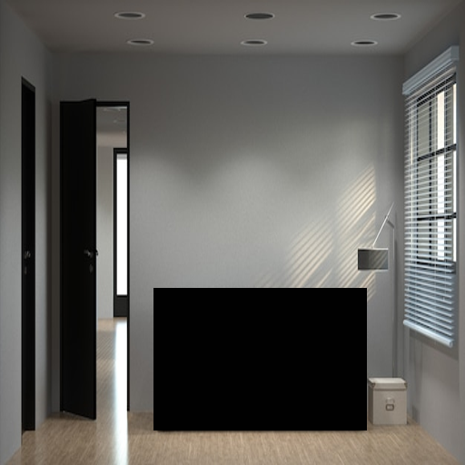

# Пайплайн обучения

1. Собираем датасет из различных изображений комнат с мебелью. 

2. Используем Grounded-SAM модели для сегментации и детекции элементов мебели.

    Github: https://github.com/IDEA-Research/Grounded-Segment-Anything

    Segmentation: https://huggingface.co/facebook/sam-vit-base

    Detection: https://huggingface.co/IDEA-Research/grounding-dino-tiny 
    
    Отмечаем элементы мебели, с которыми хотим работать: a chair, a table, a sofa…
    
3. Вырезаем сегментированные элементы мебели, сохраняем. 

    
4. Вырезаем bounding boxes из изображений комнат. Сохраняем в датасет изображения и привязываем к ним сегментированные изображения элементов мебели.
    
5. Переводим с помощью модели 2d to 3d переводим элемент мебели в 3d, поворачиваем его, и собираем несколько экземпляров изображений элемента мебели в разных ракурсах.

    Модель: https://huggingface.co/spaces/stabilityai/TripoSR 
    
6. На сгенерированном датасете дообучаем IP-adapter модель, вместе с StableDiffusionInpainting.

    
   
    Используем Inpainting с изображением комнаты, на которой вырезали bounding box с элементом мебели.

    В качестве Image Prompt используем элементы мебели с разных ракурсов.
    
    Модель: https://huggingface.co/h94/IP-Adapter

# Inference

1. Пользователь выделяет в bounding box область, на которую он хочет поставить элемент мебели.

2. Загружает элемент мебели, который он хочет использовать в качестве Image Prompt.
3. Результат - модель помещает на изображение комнаты мебель.

